<div align="center">
  <p>
    <a href="https://github.com/luohuabuxiema/LabelPaw" target="_blank">
      </a>
  </p>
  <a href="README.md">English</a> | <a href="README_zh-CN.md">简体中文</a>
</div>


# LabelPaw - Intelligent Image Annotation System (v2.0.0)

## Foreword
Defeat AI with AI! Fully automated AI development, 10x efficiency! Because of the need to annotate datasets for a project, I previously used tools like labelme and labelimg. Therefore, I decided to integrate excellent vision models like SAM2, SAM3, and YOLO pose estimation to develop a smarter and more efficient annotation tool. After multiple iterations, the system has welcomed the brand-new **version 2.0.0**!

Source Code: [https://github.com/luohuabuxiema/LabelPaw](https://github.com/luohuabuxiema/LabelPaw)

## Changelog

- 2026-05-15: Added keypoint template skeletons for faces, hands, and pedestrians. Supports customizing keypoint templates and connections.
- 2026-05-14: Added the SAM2.1 model to achieve intelligent point-and-click annotation, and integrated the Ultralytics YOLO model. The YOLO model can be used for intelligent annotation of rectangles, segmentation, keypoints, and OBB (Oriented Bounding Boxes).
- 2026-05-13: Improved JSON/XML/YOLO format conversion, supported JSON to U-Net Mask conversion, and one-click random dataset splitting.
- 2026-05-10: Added support for Light and Dark theme modes, providing a more comfortable visual experience.
- 2026-04-12: Built the foundational intelligent annotation interface based on PySide6 (First Release).
- 2026-04-10: Integrated the latest generation SAM3, supporting hover preview, single-point rapid contour extraction, and text prompt-based full-image object auto-segmentation.
- 2026-04-09: Supported Rectangle (Rect), Polygon (Poly), and Point annotation, as well as an original OBB rotation box control handle (supports 360° stepless smooth rotation and slide-to-wall detection).
- 2026-04-08: Supported native saving of JSON, YOLO (.txt), and XML (Pascal VOC).

## System Introduction

The system is built on PySide6 and integrates the **SAM2**, **SAM3**, and **Ultralytics YOLO** vision models, which significantly enhances annotation efficiency:
- **Intelligent Point-and-Click & Prompt Segmentation**: When SAM intelligent annotation is enabled, it supports rapid object extraction in modes like polygon, rectangle, and OBB.
- **Keypoint Skeleton Templates & Intelligent Annotation**: A brand-new keypoint module with built-in templates for pedestrians, hands, faces, etc. You can customize keypoint templates for quick annotation, and optionally use the YOLO model for intelligent keypoint detection and automatic connection.

| Feature | Interface Demonstration |
| --- | --- |
| Polygon Annotation | 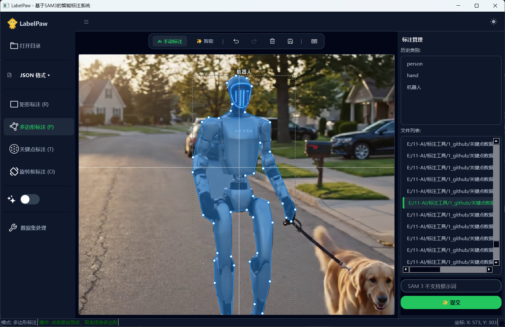 |
| OBB Intelligent Annotation | 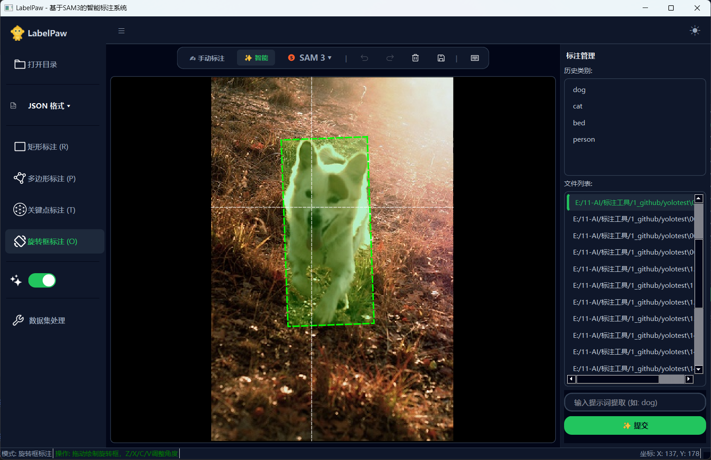 |
| Rectangle Intelligent Annotation | 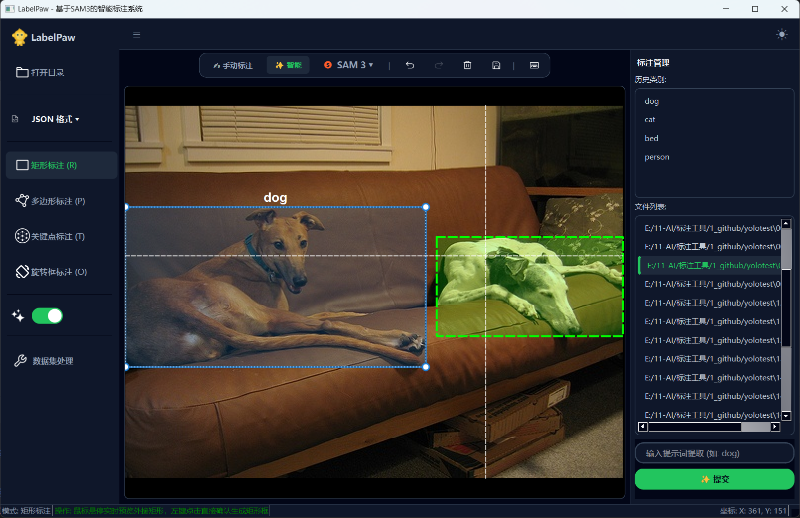 |
| Keypoint Annotation | 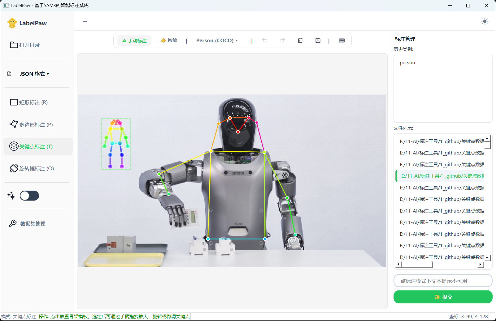 |
| Keypoint Intelligent Annotation | 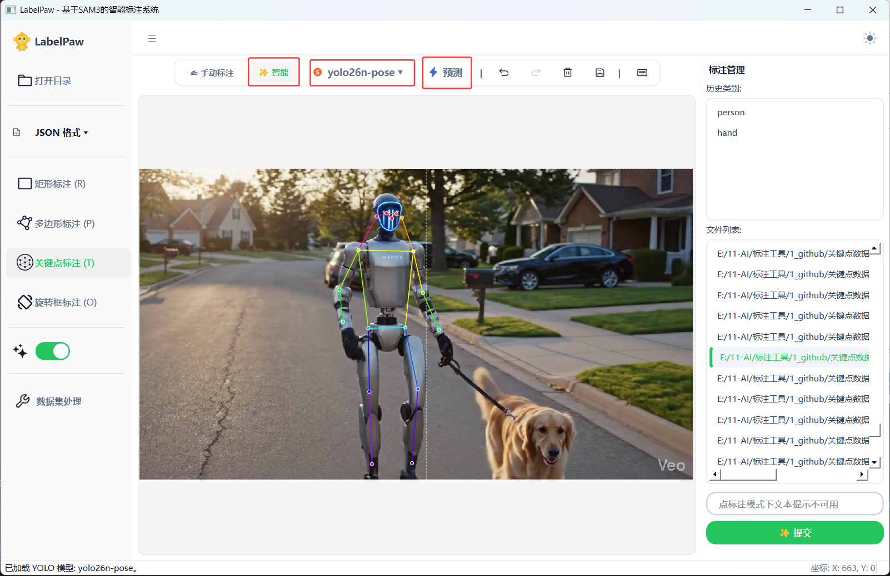 |
| Built-in Keypoint Templates | 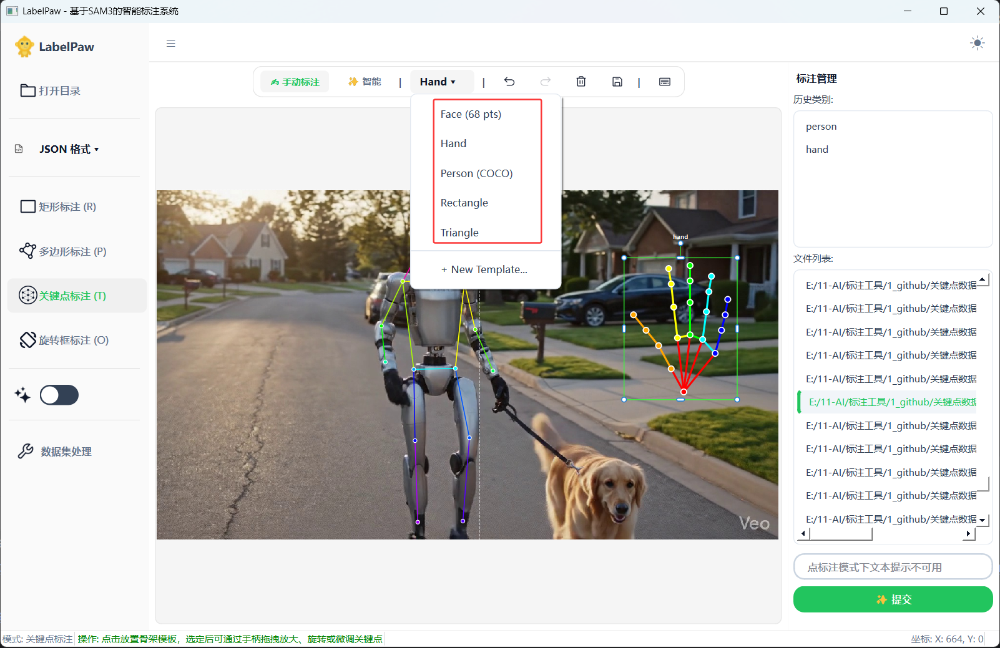 |
| Face Keypoint Template | 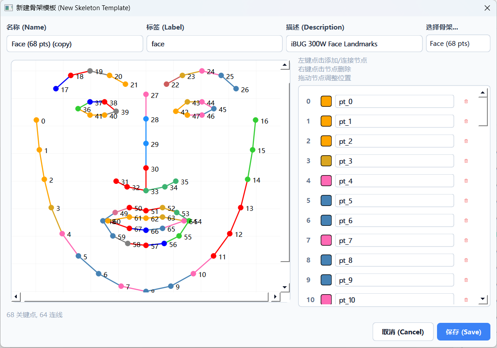 |
| Hand Keypoint Template | 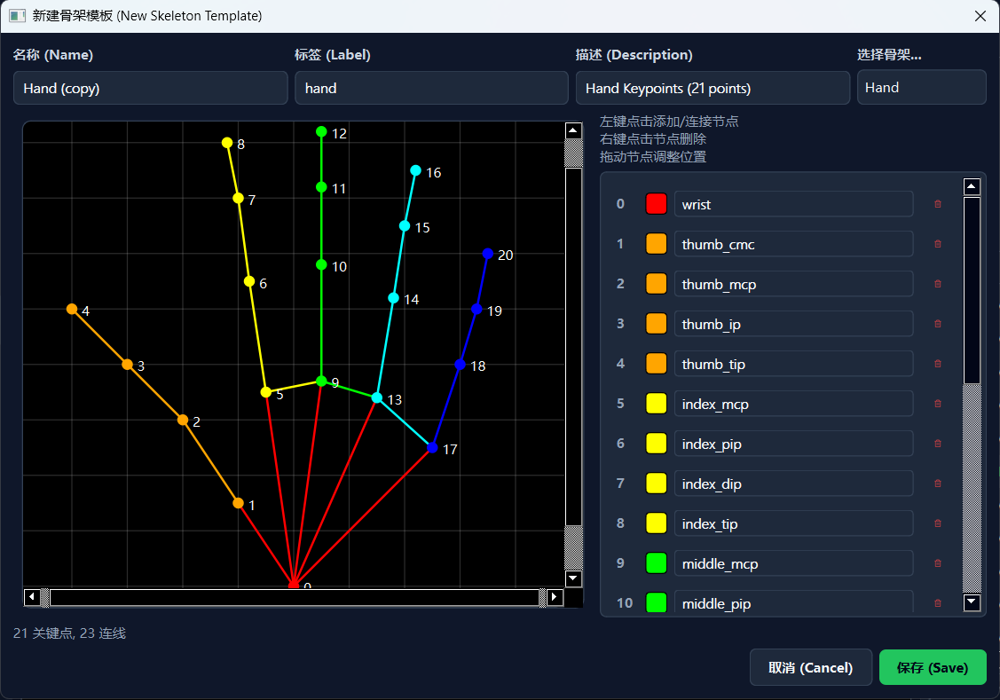 |
| Custom Keypoint Template | 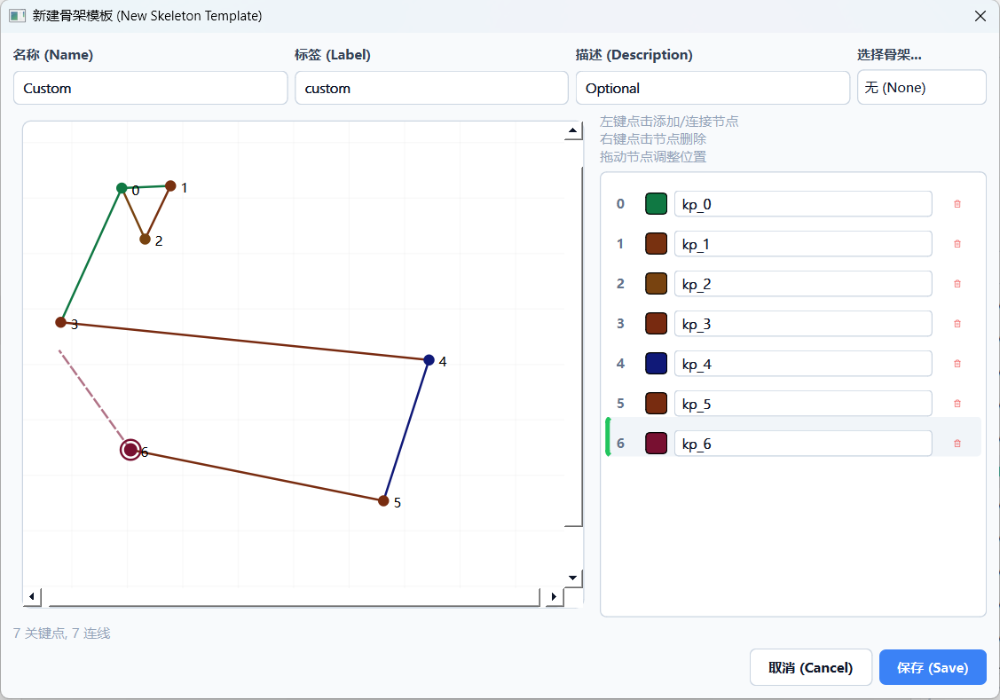 |
| Dark Theme | 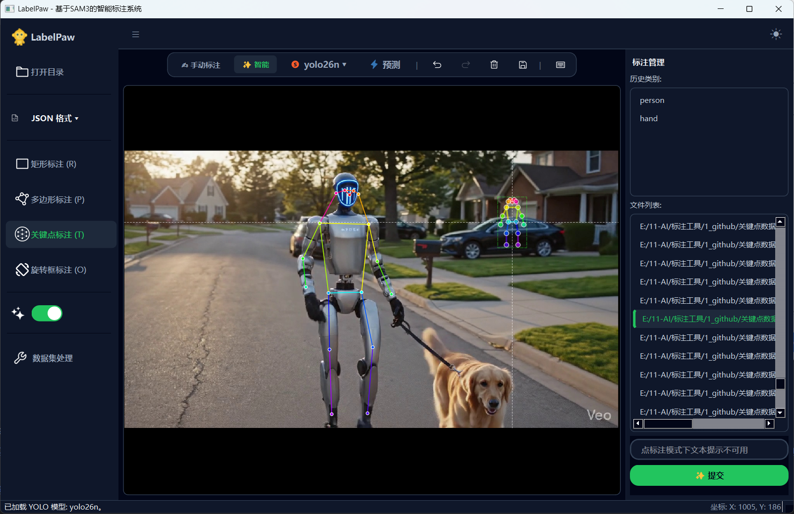 |
| Dataset Processing Tool | 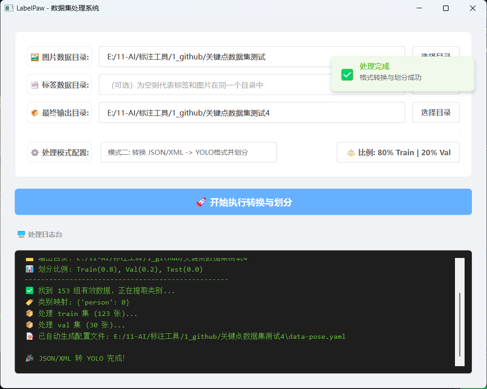 |

## 🙊 Core Features

- **✨ AI Intelligent Assistance (SAM2/SAM3 Driven)**: Hover preview, single-point rapid contour extraction, text prompt-based full-image object auto-segmentation.
- **🦴 Keypoint Skeleton Templates & Intelligent Annotation (YOLO Driven)**: Supports intelligent annotation for rectangles, segmentation, OBB, and keypoints. Built-in keypoints for pedestrians (17 keypoints), faces (68 keypoints), and hands (21 keypoints). Keypoint annotation supports customized skeleton templates.
- **📐 Versatile Annotation Modes**: Rectangle (Rect), Polygon (Poly), Point, OBB (Oriented Bounding Box), and Pose (Keypoints).
- **🔄 Ultimate OBB Interaction**: Rotation box control handle with 360° stepless smooth rotation and slide-to-wall detection.
- **💾 Multi-Format Conversion & Export**: Native support for saving JSON, YOLO (.txt), XML (Pascal VOC), and one-click generation of U-Net Masks.
- **🗄️ Dataset Processing Workflow**: Supports proportional splitting of train/val/test sets.

---

## 🛠️ Deployment & Execution Environment

### 1. Basic Environment Dependencies

Python 3.10+ is recommended.

Create a virtual environment with the following command:

```python
conda create -n py311 python==3.11.5
```
Enter the newly created virtual environment:

```python
conda activate py311 
```

First, install the necessary Python dependencies:

Separately install `torch>=2.5.0`. PyTorch official website: [https://pytorch.org/](https://pytorch.org/get-started/previous-versions/?_gl=1*r08hqw*_up*MQ..*_ga*MTg1ODQzMTE5LjE3NzU4ODk5NDI.*_ga_469Y0W5V62*czE3NzU4ODk5NDEkbzEkZzAkdDE3NzU4ODk5NDEkajYwJGwwJGgw/)


**💡 PyTorch Installation Notes (Must Read for Beginners)**

Before installing PyTorch, please verify the following points to avoid runtime errors after installation:

**1. Confirm GPU Support and CUDA Version (Extremely Important)**
* **Applicable System**: This tutorial is based on the Windows environment.
* **How to Check**: Press `Win + R`, type `cmd` to open the command prompt, type `nvidia-smi`, and press Enter. In the top right corner of the table that appears, look for the **CUDA Version**.


* **Version Matching Requirement**: The PyTorch CUDA version you download (e.g., `cu118` or `cu116` in the command) **must be less than or equal to** the CUDA Version you just found on your computer. If your computer does not have a dedicated NVIDIA card, or if you cannot find this information, please choose the **CPU version** installation command on the official website.

**2. Choose Either Conda or Pip Command**

Install the specified version based on your computer. The installation command is as follows. If the `conda` command gets stuck, you can try configuring domestic mirrors (Tsinghua/USTC) in the terminal first, and then remove `-c pytorch -c nvidia` at the end of the command (because adding `-c` forces the download from the official foreign channels):

```bash
conda install pytorch==2.5.0 torchvision==0.20.0 torchaudio==2.5.0  pytorch-cuda=11.8 -c pytorch -c nvidia
```

The above command usually fails to install. Therefore, it is recommended to use the Alibaba Cloud mirror source for installation. The `whl` packages for the PyTorch GPU version on Alibaba Cloud can be viewed here: [https://mirrors.aliyun.com/pytorch-wheels](https://mirrors.aliyun.com/pytorch-wheels/)

The `cu` version at the end needs to correspond to the CUDA version number. For example, to install CUDA 11.8, write `cu118`.

```bash
-f  https://mirrors.aliyun.com/pytorch-wheels/cu118
```
CUDA 11.8 Installation Command:
```bash
pip install torch==2.5.0 torchvision==0.20.0 torchaudio==2.5.0 -f  https://mirrors.aliyun.com/pytorch-wheels/cu118
```
CUDA 12.1 Installation Command:
```bash
pip install torch==2.5.0 torchvision==0.20.0 torchaudio==2.5.0 -f  https://mirrors.aliyun.com/pytorch-wheels/cu121
```

**3. Verify Installation**
After the installation progress bar is completed, do not rush to close the window! Enter `python` in the terminal and type the following code:
```python
import torch
print(torch.__version__)
print(torch.cuda.is_available())
print(torch.cuda.device_count())
print(f"CUDA: {torch.version.cuda}")
```
If it outputs `True`, congratulations, CUDA is available! If it outputs `False`, it means the CPU version was installed or there is a CUDA mismatch, which may require uninstallation and reinstallation.

---

Afterwards, in your virtual environment, use the following command to install the required libraries:

```
pip install -r requirements.txt
```
```python
pyside6~=6.4.2
numpy~=1.24.4
opencv-python~=4.11.0.86
pillow~=10.4.0
einops~=0.8.2
pycocotools~=2.0.11
scipy~=1.15.3
tqdm~=4.67.1
iopath~=0.1.10
matplotlib~=3.10.8
timm~=1.0.26
ftfy~=6.3.1
psutil~=7.2.1
torchmetrics~=1.5.0
omegaconf~=2.3.0
numba~=0.64.0
huggingface-hub~=0.36.2
pandas~=2.3.3
scikit-learn~=1.8.0
setuptools==79.0.1
git+https://github.com/facebookresearch/sam3.git
git+https://github.com/facebookresearch/sam2.git
ultralytics==8.4.49
```

> Note: If you want to use the intelligent assistance feature, please ensure that the libraries related to `sam3`, `sam2`, and `ultralytics` along with their dependencies are correctly configured in your environment. If the above installation of `sam3`, `sam2`, or `ultralytics` fails, there is also a source code installation tutorial below.

#### Errors Encountered During Installation

(1) Could not create the virtual environment, error reported as follows:


Solution: Go to `C:\Users\YourUser` and delete the `.condarc` file.

(2) Error: `ModuleNotFoundError: No module named 'pkg_resources'`


Solution: Downgrade the `setuptools` library version. The version I installed is 79.0.1.

```python
pip install setuptools==79.0.1
```


Reference Link: [https://blog.csdn.net/u014451778/article/details/158469881](https://blog.csdn.net/u014451778/article/details/158469881/)

(3) Error: `ModuleNotFoundError: No module named 'triton'`


Solution: Download the offline installation package and install it separately.

Triton offline installation package download address: [https://hf-mirror.com/madbuda/triton-windows-builds](https://hf-mirror.com/madbuda/triton-windows-builds/)


Reference Link: [https://blog.csdn.net/qq_42910179/article/details/155606159](https://blog.csdn.net/qq_42910179/article/details/155606159/)

### 2. Source Code Installation for SAM3, SAM2, and Ultralytics

To ensure that SAM2, SAM3, and Ultralytics (YOLO) work properly, you need to go to their official repositories to download the source code and place it in the `LabelPaw` root directory. Because the official libraries are constantly updating, using the source code method maximizes compatibility.

**Official Source Code Addresses**:

- **SAM2**: [https://github.com/facebookresearch/sam2](https://github.com/facebookresearch/sam2)
- **SAM3**: [https://github.com/facebookresearch/sam3](https://github.com/facebookresearch/sam3)
- **Ultralytics (YOLO)**: [https://github.com/ultralytics/ultralytics](https://github.com/ultralytics/ultralytics)

**Steps**:

1. Visit the GitHub addresses above, click the green **Code** button, and select **Download ZIP**.
2. Unzip the downloaded files.
3. **Important**: The unzipped folders often contain documents, test cases, and many other files. You only need the **core code folder** inside the unzipped directory (after downloading, you will see folders named `sam2`, `sam3`, and `ultralytics`).
4. Paste these three folders (`sam2`, `sam3`, `ultralytics`) directly into the root directory of `LabelPaw`.

**Direct Installation via Command Line (Optional, Recommended for Advanced Users)**:
If you do not want to download and copy folders manually, you can use pip to install directly from the GitHub source or PyPI:

```bash
# Install SAM2
pip install git+https://github.com/facebookresearch/sam2.git

# Install SAM3
pip install git+https://github.com/facebookresearch/sam3.git

# Install Ultralytics
pip install ultralytics
```

> ⚠️ **Notes on the `git+` Installation Method**:
> 1. **Git Required**: Your computer must have [Git](https://git-scm.com/) installed and configured in advance, otherwise the command will fail directly.
> 2. **Network Issues in China**: Because GitHub access is unstable in some parts of China, using `git+https://...` can easily result in a `Time out` or connection failure. For users in China, it is recommended to:
>    - Use a VPN (scientific internet access) and temporarily set a Git proxy in the command line.
>    - Or preferentially use the **official source code download and unzip** method above, as this is the safest way.

### 3. Model Download & Configuration Modification

**Model Download and Storage Instructions**:

To enable intelligent annotation, you need to download the corresponding weight files (`.pt`) and organize them according to the standard directory structure.

**1. Recommended Model Storage Directory Structure**
It is recommended to organize your model files locally according to the following structure:
```text
 weights/
      ├── sam_weights/          <-- Store all SAM series models (Must be named this way)
      │    ├── sam3.pt
      │    ├── sam2.1_hiera_tiny.pt
      │    └── ...
      ├── yolo26_weights/       <-- Store YOLO26 series models
      │    ├── yolo26n-pose.pt
      │    └── ...
      ├── yolov8_weights/       <-- You can also create other YOLO version folders yourself
      │    ├── yolov8n.pt
      │    └── ...
      └── ...
```

**2. SAM Series Model Download and Storage**

- **SAM 3 Model (3.5 GB)**: Go to the official GitHub repository or HuggingFace and search for `sam3`. Store it in `\weights\sam_weights\sam3.pt`.
- **SAM 2.1 Models**:
  - SAM 2.1 Tiny: [https://dl.fbaipublicfiles.com/segment_anything_2/092824/sam2.1_hiera_tiny.pt](https://dl.fbaipublicfiles.com/segment_anything_2/092824/sam2.1_hiera_tiny.pt)
  - SAM 2.1 Small: [https://dl.fbaipublicfiles.com/segment_anything_2/092824/sam2.1_hiera_small.pt](https://dl.fbaipublicfiles.com/segment_anything_2/092824/sam2.1_hiera_small.pt)
  - SAM 2.1 Base: [https://dl.fbaipublicfiles.com/segment_anything_2/092824/sam2.1_hiera_base_plus.pt](https://dl.fbaipublicfiles.com/segment_anything_2/092824/sam2.1_hiera_base_plus.pt)
  - SAM 2.1 Large: [https://dl.fbaipublicfiles.com/segment_anything_2/092824/sam2.1_hiera_large.pt](https://dl.fbaipublicfiles.com/segment_anything_2/092824/sam2.1_hiera_large.pt)
  - Storage Location: `\weights\sam_weights\` directory (Please keep the default file names).

**3. YOLO Series Model Download and Storage**
- **YOLO Models**: Go to the YOLO official GitHub or the corresponding framework page to download the latest weights (e.g., yolov8, yolo11, yolo26, etc.). For pose estimation, it is recommended to download models with the `-pose` suffix (e.g., `yolo26n-pose.pt`).
- **Storage Location**: Store them in the corresponding folder, like `\weights\yolo26_weights\`. *(Note: You can also place your own trained YOLO models in the corresponding folder, and the software will automatically read them!)*

**Model Path Modification Instructions**:
In order for the system to find the models you downloaded:

> Method 1: Create a `weights` folder in the project root directory to store the models. See the structure above.

> Method 2: Create a `weights` folder elsewhere to store the models. See the structure above. You **only** need to modify one base path variable in the code:
Open `main.py`, `core/sam_client.py`, and `ui/model_selector_dialog.py`, find the `HARDCODED_DEV_DIR` variable, and uniformly change it to the absolute path of your local `weights` folder: **HARDCODED_DEV_DIR= r"Your Absolute Path\weights"**

*(Note: The system will automatically scan all subfolders shaped like `yolo*_weights` under this directory and load the YOLO models. Therefore, you just need to place the models, and there is no need to manually specify the YOLO subdirectories!)*

**[Special Note: Advice for Users Without a Dedicated GPU]**
If your computer does not have a dedicated graphics card (GPU) or has low specs, it is strongly recommended that you prioritize using YOLO series models (like the lightweight models with "n" or "s"). SAM series models, even the tiny version, are relatively heavy, and running them in a pure CPU environment may cause severe lag or lead to the software becoming unresponsive. Lightweight YOLO models can maintain good processing speeds even on a CPU.

### 4. Start the System

After all configurations are complete, run the following in the root directory:
```bash
python main.py
```

---

## 📖 User Operation Guide

### 📋 Basic Workflow

1. **Open Directory**: Click "Open Directory" to select the image folder.
2. **Select Format**: In the left dropdown menu, select the save format (JSON / YOLO / XML).
3. **Annotation Mode**: Select the left toolbar for rectangle, keypoint, OBB, or polygon annotation mode, or use keyboard shortcuts.
4. **Intelligent Annotation**: Turn on **SAM Intelligent Assistance** at the bottom left (Shortcut: Q). SAM3/SAM2 supports hover preview and point-and-click. The SAM3 model supports text prompt annotation. You can select other models in the top toolbar or use YOLO intelligent pre-inference for annotation.
5. **Keypoint/Skeleton Annotation**: After selecting the keypoint annotation mode, you can choose built-in keypoint skeleton templates in the top toolbar. Currently, the built-in skeleton templates include faces, hands, and pedestrians. You can also use YOLO intelligent pre-inference or customize keypoint skeleton templates.
6. **Dataset Processing**: Click "Dataset Conversion" on the toolbar to execute format conversion, U-Net Mask generation, and train/val dataset splitting.

### ⌨️ Shortcut Keys

- **A / Left Arrow**: Previous Image
- **D / Right Arrow**: Next Image
- **Ctrl + S**: Manually save the current annotation
- **Q**: Toggle SAM Intelligent Assistance On/Off
- **R**: Rectangle Annotation (Rect)
- **P**: Polygon Annotation (Poly)
- **O**: Oriented Bounding Box Annotation (OBB)
- **T**: Keypoint Annotation (Pose/Point)
- **M**: Use YOLO model for inference (Requires intelligent assistance to be on and the corresponding model to be loaded)
- **E**: Modify the current selected label category
- **Del / Backspace**: Delete selected annotation box/point
- **Ctrl + Z**: Undo (Supports 20 steps)
- **Ctrl + Y (or Ctrl + Shift + Z)**: Redo
- **Z / X / C / V**: OBB rotation box quick fine-tuning angle

---

## 🤝 Secondary Development Welcome

The system uses a modular design with high cohesion and low coupling. The frontend UI is separated from the underlying model inference.
- `main.py`: Main control interface and event routing.
- `core/`: Core drawing (`canvas.py`), data export (`exporter.py`), SAM inference (`sam_client.py`), YOLO inference (`yolo_predictor.py`).
- `ui/`: Graphical components and theme customization.

Developers are welcome to Fork and submit PRs!

## License

This project is licensed under the GPL-3.0 License. If you use this code in commercial or non-commercial projects, please comply with this license and open source your derivative modifications. Thank you for your support, and if this helps, please give the repository a Star!

### Citation

If you use this software in your research, please cite as follows:

```bibtex
@misc{LabelPaw,
  year = {2026},
  author = {luohuabuxiema},
  publisher = {Github},
  journal = {Github repository},
  title = {LabelPaw: Intelligent image annotation system},
  howpublished = {\url{https://github.com/luohuabuxiema/LabelPaw}}
}
```

**Acknowledgments and Reference Model Citations**:

```bibtex
@misc{carion2025sam3segmentconcepts,
      title={SAM 3: Segment Anything with Concepts},
      author={Nicolas Carion et al.},
      year={2025},
      eprint={2511.16719},
      archivePrefix={arXiv},
      primaryClass={cs.CV},
      url={https://arxiv.org/abs/2511.16719},
}

@article{ravi2024sam2,
  title={SAM 2: Segment Anything in Images and Videos},
  author={Ravi, Nikhila and Gabeur, Valentin and Hu, Yuan-Ting and Hu, Ronghang and Ryali, Chaitanya and Ma, Tengyu and Khedr, Haitham and R{\"a}dle, Roman and Rolland, Chloe and Gustafson, Laura and others},
  journal={arXiv preprint arXiv:2408.00714},
  year={2024}
}

@software{ultralytics,
  author = {Glenn Jocher and Ayush Chaurasia and Jing Qiu},
  title = {Ultralytics},
  year = {2023},
  url = {https://github.com/ultralytics/ultralytics},
  license = {AGPL-3.0}
}
```